# Build end-to-end streaming data pipelines fast

Welcome to HappyFeet store - Where Every Step Matters! In this workshop, we harness the power of customer data, clickstreams, and order information to identify customers who spend minimal time on our website. Our goal is to launch a targeted marketing campaign that re-engages these customers, ensuring that every second they spend on our website is worthwhile. Join us in this journey to provide a personalized and memorable shopping experience at HappyFeet, where style, comfort, and exceptional customer service converge.

<div align="center"> 
  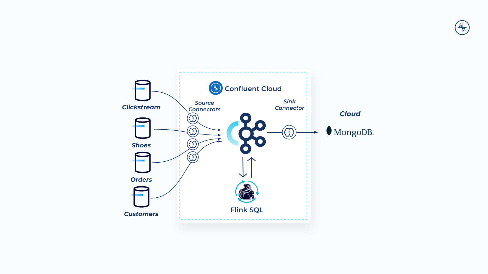
</div>

---

# Requirements

In order to successfully complete this demo you need to install few tools before getting started.

- If you don't have a Confluent Cloud account, sign up for a free trial [here](https://www.confluent.io/confluent-cloud/tryfree).
- Install Confluent Cloud CLI by following the instructions [here](https://docs.confluent.io/confluent-cli/current/install.html).

- Download and Install Terraform [here](https://developer.hashicorp.com/terraform/downloads?ajs_aid=837a4ee4-253b-4b3d-bf11-952575792ad1&product_intent=terraform)

- (Optional) Sign up for a free MongoDB Atlas account [here](https://www.mongodb.com/cloud/atlas/register?utm_campaign=devrel&utm_source=workshop&utm_medium=cta&utm_content=Confluent%20x%20AWS%20x%20MongoDB%20Workshop%20%40%20Data%20in%20Motion%20Tour%20FY25&utm_term=jade.furubayashi).

  > **Note:** This demo was built and validate on a Mac (x86).

## Setup

### 1. Confluent Cloud

Create Confluent Cloud API keys by following steps.

> **Note:** This is different than Kafka cluster API keys.

1.1. Login to Confluent Cloud.

    Right Panel -> Click on Accounts & Access
 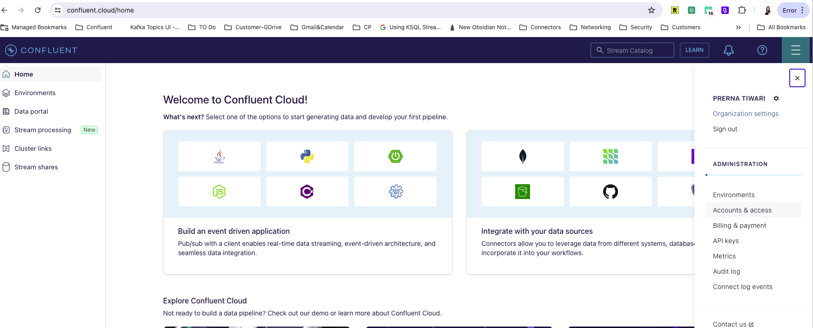

1.2. Create [Service Account](https://confluent.cloud/settings/org/accounts/service-accounts/add)
    
    Choose Service Account -> Click on + Add Service Account
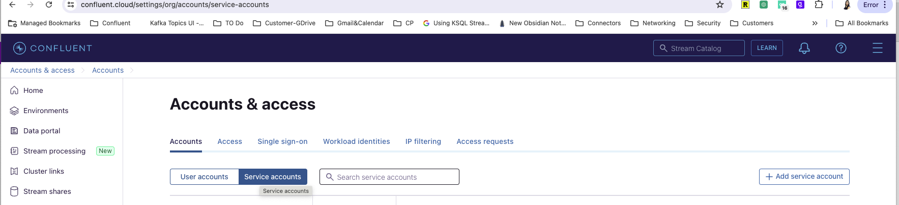

    Add Name and description as tf-runner -> click Next
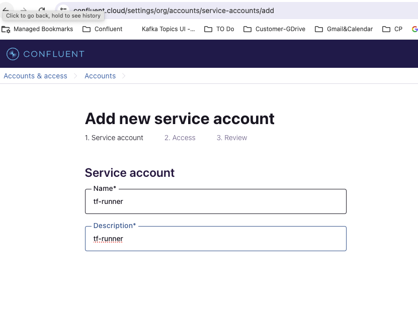

    Add Access -> Select Organization -> Click Add Role Assignment -> Select OrganizationAdmin -> Click Next
  
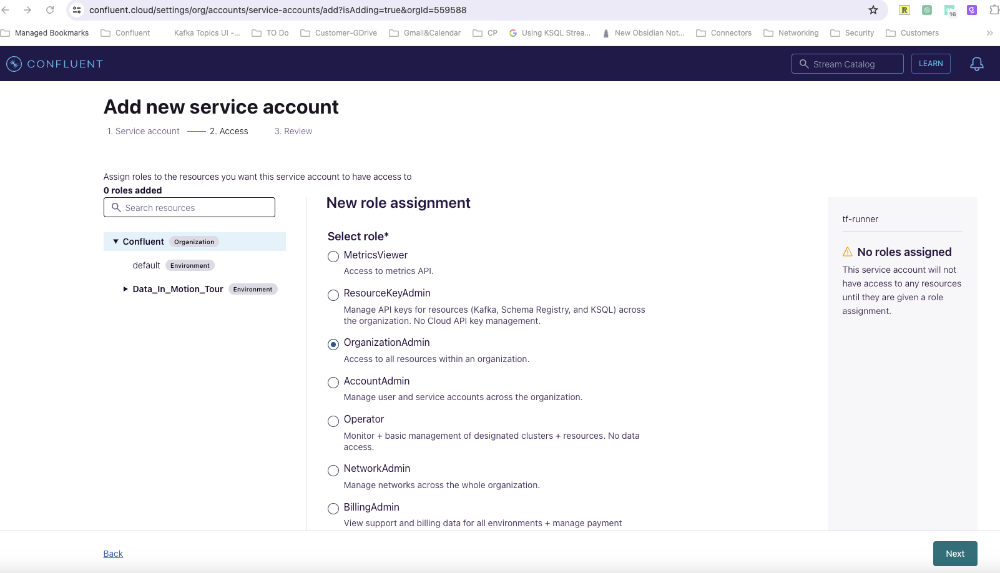
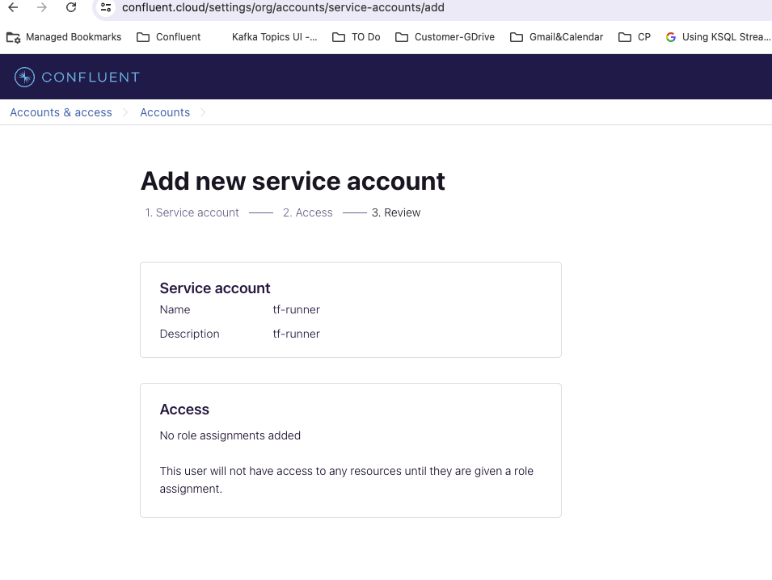 

    Click -> Create Service Account

1.3. Create [API Keys](https://confluent.cloud/settings/api-keys/create) for the service account
    Right Side bar -> Click on API Keys
    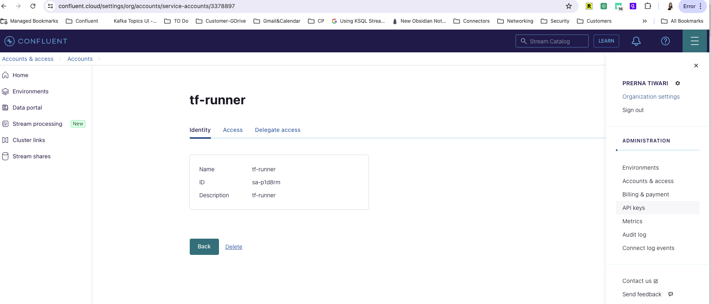

    Select Service Account -> Existing Account -> choose 'tf-runner' as a service account -> Click Next
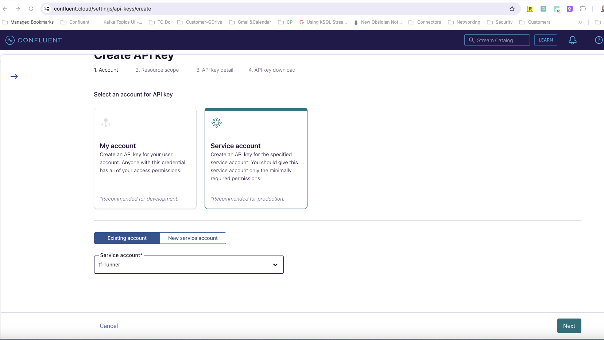

    Select Resource Scope -> **Cloud Resource Management**
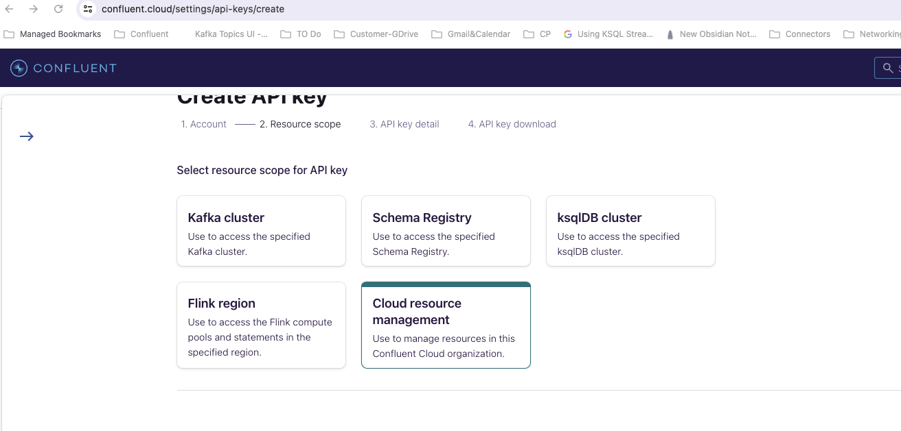

    Creat API Key -> Add Name and Description - tf-runner -> Click Create API Key -> Download API Keys -> Click Complete
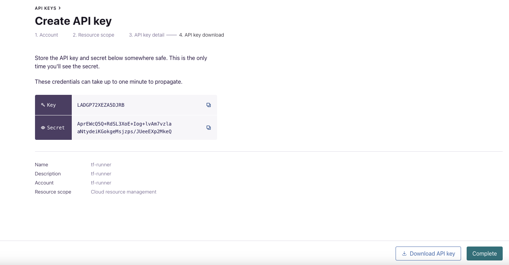


### 2. MongoDB Atlas (Optional)

2.1. Log into [MongoDB web UI](https://www.mongodb.com/).

2.2. Use the left-hand side menu an navigate to **Settings** and copy the **Organization ID**. You'll update the `.accounts` file later with this value.

2.3. Create an API key pair so Terraform can create resources in the Atlas cluster. To do this, use the left-hand and click on **Access Manager** then **Create API Key** on the top right-side of the screen.

2.4. Add a description and select **Organization Owner** for the permission level.

2.5. For detailed instructions and troubleshooting visit the [docs](https://registry.terraform.io/providers/mongodb/mongodbatlas/latest/docs#configure-atlas-programmatic-access).

### 3. Terraform Setup
 This demo uses Terraform and bash scripting to create and teardown infrastructure and resources.

3.1. Clone and enter this repository.

   ```bash
   git clone https://github.com/confluentinc/live-labs.git
   cd live-labs/DIMT2024
   git checkout anz
   ```

3.2. Create an `.accounts` file by running the following command.

   ```bash
   echo "CONFLUENT_CLOUD_EMAIL=add_your_email\nCONFLUENT_CLOUD_PASSWORD=add_your_password\nexport TF_VAR_confluent_cloud_api_key=\"add_your_api_key\"\nexport TF_VAR_confluent_cloud_api_secret=\"add_your_api_secret\"\nexport TF_VAR_mongodbatlas_public_key=\"add_your_public_key\"\nexport TF_VAR_mongodbatlas_private_key=\"add_your_private_key\"\nexport TF_VAR_mongodbatlas_org_id=\"add_your_org_id\"" > .accounts
   ```

   > **Note:** This repo ignores `.accounts` file

3.3. ### Update the accounts file

Update the `.accounts` file for the following variables with your credentials.

```bash
 CONFLUENT_CLOUD_EMAIL=<replace>
 CONFLUENT_CLOUD_PASSWORD=<replace>
 export TF_VAR_confluent_cloud_api_key="<replace>"
 export TF_VAR_confluent_cloud_api_secret="<replace>"
 export TF_VAR_mongodbatlas_public_key="<replace>"
 export TF_VAR_mongodbatlas_private_key="<replace>"
 export TF_VAR_mongodbatlas_org_id="<replace>"
```

### 4. Create a local environment file

4.1. Navigate to the `confluent` directory of the project and run `create_env.sh` script. This bash script copies the content of `.accounts` file into a new file called `.env` and append additional variables to it.

   ```bash
   cd confluent
   ./create_env.sh
   ```

4.2. Source `.env` file.

   ```bash
   source ../.env
   ```

   > **Note:** if you don't source `.env` file you'll be prompted to manually provide the values through command line when running Terraform commands.

### 5. Build your cloud infrastructure

5.1. Navigate to the repo's terraform directory.

   ```bash
   cd ../terraform
   ```

5.2. Initialize Terraform within the directory.
   ```bash
   terraform init
   ```
5.3. Create the Terraform plan.
   ```bash
   terraform plan
   ```
5.4. Apply the plan to create the infrastructure. You can run `terraform apply -auto-approve` to bypass the approval prompt.

   ```bash
   terraform apply
   ```

   > **Note:** Read the `main.tf` configuration file [to see what will be created](./terraform/main.tf).

5.5. Write the output of `terraform` to a JSON file. The `setup.sh` script will parse the JSON file to update the `.env` file.

   ```bash
   terraform output -json > ../resources.json
   ```

5.6. Run the `setup.sh` script.
   ```bash
   cd ../confluent
   ./setup.sh
   ```
5.7. This script achieves the following:

   - Creates an API key pair that will be used in connectors' configuration files for authentication purposes.
   - Updates the `.env` file to replace the remaining variables with the newly generated values.

5.8. Source `.env` file.

   ```bash
   source ../.env
   ```

# 6. Demo

## 6.1 Configure Source Connectors

Confluent offers 120+ pre-built [connectors](https://www.confluent.io/product/confluent-connectors/), enabling you to modernize your entire data architecture even faster. These connectors also provide you peace-of-mind with enterprise-grade security, reliability, compatibility, and support.

### 6.2 Automated Connector Configuration File Creation

You can use Confluent Cloud CLI to submit all the source connectors automatically.

Run a script that uses your `.env` file to generate real connector configuration json files from the example files located in the `confluent` folder.

```bash
./create_connector_files.sh
```

### 6.3 Produce Sample Data

You can create the connector either through CLI or Confluent Cloud web UI.

<details>
    <summary><b>CLI</b></summary>

6.3.1. Log into your Confluent account in the CLI.

   ```bash
   confluent login --save
   ```

6.3.2. Use your environment and your cluster.

   ```bash
   confluent environment list
   confluent environment use <your_env_id>
   confluent kafka cluster list
   confluent kafka cluster use <your_cluster_id>
   ```

6.3.3. Run the following commands to create Datagen source connectors.

   ```bash
   confluent connect cluster create --config-file actual_datagen_clickstream.json
   confluent connect cluster create --config-file actual_datagen_shoe_customers.json
   confluent connect cluster create --config-file actual_datagen_shoe_orders.json
   confluent connect cluster create --config-file actual_datagen_shoes.json
   ```

</details>
<br>

<details>
    <summary><b>Confluent Cloud Web UI</b></summary>

6.4.1. Log into Confluent Cloud by navigating to confluent.io and click on the **Login** on the top right corner.

6.4.2. Step into **Data_In_Motion_Tour** environment.

6.4.3. Step into **dimt_kafka_cluster**.

6.4.4. On the navigation menu, select **Connectors** and then **+ Add connector**.

6.4.5. In the search bar search for **Sample Data** and select the **Sample Data** which is a fully-managed connector.

6.4.6. Create 4 new connectors using values in `actual_datagen_*` files.

</details>
<br>

Once all connectors are fully provisioned, check for and troubleshoot any failures that occur. Properly configured, each connector begins reading data automatically.

## 7. Process and Enrich Data Streams with Flink SQL

Now that you have data flowing through Confluent, you can now easily build stream processing applications using Flink SQL. You are able to continuously transform, enrich, join, and aggregate your data using SQL syntax. You can gain value from your data directly from Confluent in real-time. Also, Confluent Cloud for Flink provides a truly cloud-native experience for Flink. You don’t need to know about or interact with Flink clusters, state backends, checkpointing, and all of the other aspects that are usually involved when operating a production-ready Flink deployment.

If you’re interested in learning more about Flink, you can take the Apache Flink 101 course on Confluent Developer [website](https://developer.confluent.io/courses/apache-flink/intro/).

7.1.  Log into Confluent Cloud web UI, then click on **Data_In_Motion_Tour** environment.
7.2.  Click on **Flink (preview)** and then **Open SQL workspace**.
7.3.  On the top right corner of your workspace select **Data_In_Motion_Tour** as the catalog and **dimt_kafka_cluster** as your database.

    > **Note:** Refer to the [docs](https://docs.confluent.io/cloud/current/flink/index.html#metadata-mapping-between-ak-cluster-topics-schemas-and-af) to understand the mapping between Kafka and Flink.

7.4.  On the left-hand side under **Navigator** menu, click the arrow to expand the **Data_In_Motion_Tour** Kafka environment, and expand the **dimt_kafka_cluster** to see existing Kafka topics.

7.5.  You will use the code editor to query existing Flink tables (Kafka topics) and to write new queries.

7.6.  To write a new query, click on the **+** icon to create a new cell.

    > **Note:** For your convenience, all Flink queries are availble in the [flink.sql](./confluent/flink.sql) file.

7.7.  See how `orders` table was created
    ```sql
    SHOW CREATE TABLE orders;
    ```
7.8.  Explore the `orders` table

    ```sql
    SELECT * FROM orders;
    ```

7.9.  Create a table to count the unique purchases per minute. In a real world scenario an hourly window is probably more appropriate, but for the purpose of this lab we'll use minute.

    ```sql
    CREATE TABLE sales_per_minute (
        window_start TIMESTAMP(3),
        window_end   TIMESTAMP(3),
        nr_of_orders BIGINT
    );
    ```

7.10.  Confluent Cloud introduces the concept of system columns. You will use the `SYSTEM` column `$rowtime` for `DESCRIPTOR` parameter when performing windowed aggregations with Flink SQL in Confluent Cloud. Otherwise you can define your own `WATERMARK` [strategy](https://docs.confluent.io/cloud/current/flink/concepts/timely-stream-processing.html#time-and-watermarks-in-af) when creating new tables. [Tumbling windows](https://docs.confluent.io/cloud/current/flink/reference/queries/window-tvf.html#tumble) is a table-valued function (TVF) for dividing data into non-overlapping, fixed-size windows. This is useful when you want to analyze data in discrete time intervals. Now you can materialize number of unique purchase per minute in the newly created topic.

    ```sql
    INSERT INTO sales_per_minute
        SELECT window_start, window_end, COUNT(DISTINCT order_id) as nr_of_orders
        FROM TABLE(
            TUMBLE(TABLE orders, DESCRIPTOR(`$rowtime`), INTERVAL '1' MINUTE))
        GROUP BY window_start, window_end;
    ```

7.11.  Query the `sales_per_minute` table and review the data

    ```sql
    SELECT * FROM sales_per_minute;
    ```

7.12.  Let's see how many records we have in the `shoes` table with the `id = '3586de8a-10a3-4997-96bf-9e08a3a7fb82'`. The connector generates random events which results in duplicated `id`. Since there are more than 1 records, you need to deduplicate the table.

    ```sql
    SELECT * FROM shoes WHERE id = '3586de8a-10a3-4997-96bf-9e08a3a7fb82';
    ```

7.13.  [Deduplication](https://docs.confluent.io/cloud/current/flink/reference/queries/deduplication.html) removes duplicate rows over a set of columns, keeping only the first or last row. Flink SQL uses the `ROW_NUMBER()` function to remove duplicates, similar to its usage in [Top-N Queries](https://docs.confluent.io/cloud/current/flink/reference/queries/topn.html#flink-sql-top-n). Deduplication is a special case of the Top-N query, in which `N` is `1` and row order is by processing time or event time. In some cases, an upstream ETL job isn’t end-to-end exactly-once, which may cause duplicate records in the sink, in case of failover. Duplicate records affect the correctness of downstream analytical jobs, like `SUM` and `COUNT`, so deduplication is required before further analysis can continue.

    ```sql
    SELECT id, name, brand
    FROM (
        SELECT *,
            ROW_NUMBER() OVER (PARTITION BY id ORDER BY $rowtime DESC) AS row_num
        FROM `shoes`)
    WHERE row_num = 1
    ```

    Let's take a look at different parts of the above query:

    - `ROW_NUMBER()` starting at one, this assigns a unique, sequential number to each row
    - `PARTITION BY` specifies how to partition the data for deduplication. This should be the column(s) which will only have one row per value after deduplication. In this case it's column `id`
    - `ORDER BY` orders by the provided column and it’s required to be a time attribute. The time attribute column can be processing time (system time of the machine running the Flink job) or event time. By default `ORDER BY` puts rows in ascending (`ASC`) order. By using `ASC` order you’ll keep the first row. Should you want to keep the last row you should use `ORDER BY <time_attribute> DESC`. Refer to [this](https://developer.confluent.io/tutorials/finding-distinct-events/flinksql.html) tutorial to learn more deduplication with Flink SQL.

7.14.  Since the output of the transient query looks right, the next step is to make the query persistent. This looks exactly like the transient query, except you first create a new table and then execute an `INSERT INTO` statement to populate the table. The `INSERT INTO` statement returns to the CLI prompt right away, having created a persistent stream processing program running in the Flink cluster, continuously processing input records and updating the resulting `deduplicated_shoes` table. A primary key constraint is a hint for Flink SQL to leverage for optimizations which specifies that a column or a set of columns in a table or a view are unique and they do not contain null. No columns in a primary key can be nullable. A primary key uniquely identifies a row in a table.

    ```sql
    CREATE TABLE deduplicated_shoes(
        id STRING,
        brand STRING,
        name STRING,
        sale_price INT,
        rating DOUBLE,
        PRIMARY KEY (id) NOT ENFORCED
    );
    ```

    ```sql
    INSERT INTO deduplicated_shoes(
        SELECT id, brand, name, sale_price, rating
        FROM (
            SELECT *,
                ROW_NUMBER() OVER (PARTITION BY id ORDER BY $rowtime DESC) AS row_num
            FROM `shoes`)
        WHERE row_num = 1
    );
    ```

7.15.  Now that you have `deduplicated_shoes` table you can join it with `clickstream`.

    ```sql
    SELECT
        c.`$rowtime`,
        c.product_id,
        s.name,
        s.brand
    FROM
        clickstream c
        INNER JOIN deduplicated_shoes s ON c.product_id = s.id;
    ```

7.16.  Create a table to find all users with average view time of less then 30 seconds. You'll achieve this by using Pattern Recognition. Refer to the [doc](https://docs.confluent.io/cloud/current/flink/reference/queries/match_recognize.html) for detailed information about Pattern Recoginition and how `MATCH_RECOGNIZE` works.

    ```sql
    CREATE TABLE inactive_users(
        user_id STRING,
        start_tstamp TIMESTAMP(3),
        end_tstamp TIMESTAMP(3),
        avgViewTime INT
    );
    ```

    ```sql
    INSERT INTO inactive_users
    SELECT *
    FROM clickstream
        MATCH_RECOGNIZE (
            PARTITION BY user_id
            ORDER BY `$rowtime`
            MEASURES
                FIRST(A.`$rowtime`) AS start_tstamp,
                LAST(A.`$rowtime`) AS end_tstamp,
                AVG(A.view_time) AS avgViewTime
            ONE ROW PER MATCH
            AFTER MATCH SKIP PAST LAST ROW
            PATTERN (A+ B)
            DEFINE
                A AS AVG(A.view_time) < 30
        ) MR;
    ```

7.17.  Now that you have a table of users who spend less than 30 seconds on the website, you can join it with `customers` table to retrive their contact information. Then you can stream this data in real time to MongoDB Atlas database where your marketing department can use this data to build a new campaign.
    ```sql
    CREATE TABLE inactive_customers_enriched(
        user_id STRING,
        avgViewTime INT,
        first_name STRING,
        last_name STRING,
        email STRING
    );
    ```

    ```sql
    INSERT INTO inactive_customers_enriched
    	SELECT
    		u.user_id,
    		u.avgViewTime,
    		c.first_name,
    		c.last_name,
    		c.email
    	FROM
    		inactive_users u
    		INNER JOIN customers c ON u.user_id = c.id;
    ```

---

## 8. Connect MongoDB Atlas to Confluent Cloud

You can create the MongoDB Atlas Sink connector either through CLI or Confluent Cloud web UI.

<details>
    <summary><b>CLI</b></summary>

8.1. Run the following command to create the MongoDB Atlas Sink connector.

   ```bash
   cd DIMT2024/confluent
   confluent connect cluster create --config-file actual_mongodb_sink.json
   ```

</details>
<br>

<details>
    <summary><b>Confluent Cloud Web UI</b></summary>

8.2.1. On the navigation menu, select **Connectors** and **+ Add connector**.
8.2.2. In the search bar search for **MongoDB** and select the **MongoDB Atlas Sink** which is a fully-managed connector.
8.2.3. Create a new MongoDB Atlas Sink connector and complete the required fields using `actual_mongodb_sink.json` file.

</details>
<br>

Once the connector is in **Running** state navigate to **cloud.mongodb.com → Collections → dimt.inactive_users** and verify messages are showing up correctly.

Refer to our [documentation](https://docs.confluent.io/cloud/current/connectors/cc-mongo-db-sink.html) for detailed instructions about this connector.

---

## CONGRATULATIONS

Congratulations on building your streaming data pipelines in Confluent Cloud! Your complete pipeline should resemble the following one.

   <div align="center"> 
      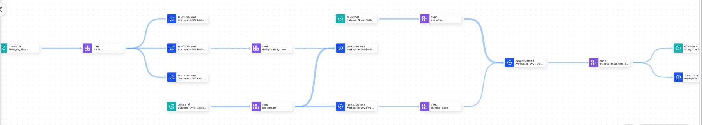
   </div>

---

# 9. Teardown

9.1. Run the following command to delete all connectors

   ```bash
   cd DIMT2024/confluent
   ./teardown_connectors.sh
   ```

9.2. Run the following command to delete all resources created by Terraform
   ```bash
   cd DIMT2024/terraform
   terraform destroy -auto-approve
   ```

# Resources

1. Flink SQL [docs](https://docs.confluent.io/cloud/current/flink/index.html)
2. Apache Flink 101 developer [course](https://developer.confluent.io/courses/apache-flink/intro/)
3. Building Apache Flink applications in Java developer [course](https://developer.confluent.io/courses/flink-java/overview/)
4. Confluent Cloud - Flink SQL shoe store workshop GitHub [repo](https://github.com/griga23/shoe-store)
5. Stream Processing Simplified blog [series](https://www.confluent.io/blog/apache-flink-for-stream-processing/)
6. Experience serverless stream processing with Confluent Cloud for Apache Flink [webinar](https://www.confluent.io/resources/online-talk/apache-flink-on-confluent-cloud/)