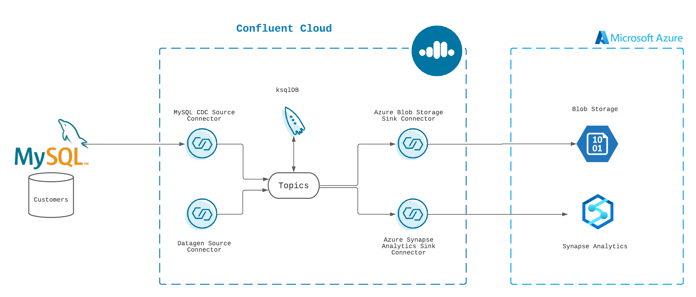
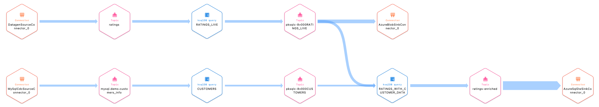

<div align="center" padding=25px>
   
</div>

# <div align="center">Building end-to-end streaming data pipelines with Confluent Cloud</div>
## <div align="center">Lab Guide</div>

For this lab, we assume we own a fictional airline company called "FictionAir".

FictionAir: stores customer information in a MySQL database. It also has a website that customers can submit feedback in real time. We will serve transformed and enriched data to 2 internal teams that have very different requirements
  * The analytics team decided to use Azure Synapse Analytics, a Cloud Data Warehouse. They want to be able to react to customers feedback as they become availabe. For example if a customer with Platinum club status had a bad experience, they want to reach out to them and sort things out. This team doesn't want to go to two different sources to get their data, they want the data to become available to them in a format and location they decided is the right choice for them. 
  * The AI team wants to use real world data to train and test their AI models. They don't want to go and find this data, so we are providing the customer rating data to them in Azure Blob Storage, which is a great solution to store large amounts of data for a long time.

To keep things simple, we will utilize Datagen Source Connector to generate **ratings** data ourseleves. Additionally, we will use MySQL CDC Source Connecter, Azure Synapse Analytics, and Blob Storage fully-managed connectors.  

---

## [Agenda](#agenda)

1. [Log into Confluent Cloud](#step1)
1. [Create an environment and cluster](#step2)
1. [Create an API key pair](#step3)
1. [Enable Schema registery](#step4)
1. [Create a ksqlDB application](#step5)
1. [Create "ratings" topic](#step6)
1. [Create a Datagen Source connector](#step7)
1. [Create customers topic](#step8)
1. [Create a MySQL CDC Source connector](#step9)
1. [Create Azure services](#step10)
1. [Enrich data streams with ksqlDB](#step11)
1. [Connect Synapse Analytics sink to Confluent Cloud](#step12)
1. [Connect Blob Storage sink to Confluent Cloud](#step13)
1. [Confluent Cloud Stream Lineage](#step14)
1. [Clean up resources](#step15)
---

## [Architecture Diagram](#architecture-diagram)
This lab will be utilizing two fully-managed source connectors (Datagen and MySQL CDC) and two fully-managed sink connectors (Azure Synapse Analytics and Blob Storage). 

## FictionAir
<div align="center"> 
  
</div>

---
## [Prerequisites](#prerequisites)

### Sign up for Confluent Cloud Account
1. Sign up for a Confluent Cloud account [here](https://www.confluent.io/get-started/).


> **Note:** You will create resources during this lab that will incur costs. When you sign up for a Confluent Cloud account, you will get free credits to use in Confluent Cloud. This will cover the cost of resources created during the lab. More details on the specifics can be found [here](https://www.confluent.io/get-started/).

### Test Network Connectivity

1. Ports `443` and `9092` need to be open to the public internet for outbound traffic. To check, try accessing the following from your web browser:
  * portquiz.net:443
  * portquiz.net:9092
    
## Sign up for Azure account

1. In order to complete this lab, you need to have a Azure account. Sign up for an account [here](https://azure.microsoft.com/en-us/features/azure-portal/).

---
## <a name="step1"></a>Step 1: Log into Confluent Cloud
1. First, access Confluent Cloud sign-in by navigating [here](https://confluent.cloud).
1. When provided with the *username* and *password* prompts, fill in your credentials.
    > **Note:** If you're logging in for the first time you will see a wizard that will walk you through the some tutorials. Minimize this as you will walk through these steps in this guide.
---
## <a name="step2"></a>Step 2: Create an environment and cluster
An environment contains Confluent clusters and its deployed components such as Connect, ksqlDB, and Schema Registry. You have the ability to create different environments based on your company's requirements. Confluent has seen companies use environments to separate Development/Testing, Pre-Production, and Production clusters.

1. Click **+ Add environment**.
    > **Note:** There is a *default* environment ready in your account upon account creation. You can use this *default* environment for the purpose of this lab if you do not wish to create an additional environment.

    * Specify a meaningful `name` for your environment and then click **Create**.
        > **Note:** It will take a few minutes to assign the resources to make this new environment available for use.

2. Now that you have an environment, let's create a cluster. Select **Create Cluster**.
    > **Note**: Confluent Cloud clusters are available in 3 types: **Basic**, **Standard**, and **Dedicated**. Basic is intended for development use cases so you should use that for this lab. Basic clusters only support single zone availability. Standard and Dedicated clusters are intended for production use and support Multi-zone deployments. If you’re interested in learning more about the different types of clusters and their associated features and limits, refer to this [documentation](https://docs.confluent.io/current/cloud/clusters/cluster-types.html).

    * Choose the **Basic** cluster type.

    * Click **Begin Configuration**.

    * Choose **Azure** as your Cloud Provider and your preferred Region.
        > **Note:** We recommend you choose East US 2 as the region for the purpose of this lab. 

    * Specify a meaningful **Cluster Name** and then review the associated *Configuration & Cost*, *Usage Limits*, and *Uptime SLA* before clicking **Launch Cluster**.

---
## <a name="step3"></a>Step 3: Create an API key pair
1. Select API keys on the navigation menu.
1. If this is your first API key within your cluster, click **Create key**. If you have set up API keys in your cluster in the past and already have an existing API key, click **+ Add key**.
1. Select **Global Access**, then click Next.
1. Save your API key and secret - you will need these during the lab.
1. After creating and saving the API key, you will see this API key in the Confluent Cloud UI in the API keys tab. If you don’t see the API key populate right away, refresh the browser.
---
## <a name="step4"></a>Step 4: Enable Schema Registery
1. On the navigation menu, select **Schema Registery**.
1. Click **Set up on my own**.
1. Choose **Azure** as the cloud provider and a supported **Region**
1. Click on **Enable Schema Registry**. 
---

## [Hands-on Lab](#handson)

**You have successfully completed the prep work. You should stop at this point and complete the remaining steps during the live session**
---
## <a name="step5"></a>Step 1: Create a ksqlDB application
> At Confluent we developed ksqlDB, the database purpose-built for stream processing applications. ksqlDB is built on top of Kafka Streams, powerful Java library for enriching, transforming, and processing real-time streams of data. Having Kafka Streams at its core means ksqlDB is built on well-designed and easily understood layers of abstractions. So now, beginners and experts alike can easily unlock and fully leverage the power of Kafka in a fun and accessible way.
1. On the navigation menu, select **ksqlDB**.
1. Click on **Create cluster myself**.
1. Choose **Global access** for the access level and hit **Continue**.
1. Pick a name or leave the name as is.
1. Select **1** as the cluster size. 
1. Hit **Launch Cluster!**. 
---
## <a name="step6"></a>Step 2: Create "ratings" topic
1. On the navigation menu, select **Topics**.
> Click **Create topic on my own** or if you already created a topic, click on the **+ Add topic** button on the top right side of the table.
2. Type **ratings** as the Topic name and hit **Create with defaults**. 
---
## <a name="step7"></a>Step 3: Create a Datagen Source connector
> Confluent offers 120+ pre-built [connectors](https://www.confluent.io/product/confluent-connectors/), enabling you to modernize your entire data architecture even faster. These connectors also provide you peace-of-mind with enterprise-grade security, reliability, compatibility, and support.
1. On the navigation menu, select **Data Integration** and then **Connectors** and **+ Add connector**.
1. In the search bar search for **Datagen** and select the **Datagen Source** which is a fully-managed connector that we will use to generate sample data with it. 
1. Use the following parameters to configure your connector
```
{
  "name": "DatagenSourceConnector_0",
  "config": {
    "connector.class": "DatagenSource",
    "name": "DatagenSourceConnector_0",
    "kafka.auth.mode": "KAFKA_API_KEY",
    "kafka.api.key": "<add_your_api_key>",
    "kafka.api.secret": "<add_your_api_secret_key>",
    "kafka.topic": "ratings",
    "output.data.format": "AVRO",
    "quickstart": "RATINGS",
    "tasks.max": "1"
  }
}
```
---
## <a name="step8"></a>Step 4: Create customers topic
1. On the navigation menu, select **Topics**.
> Click **Create topic on my own** or if you already created a topic, click on the **+ Add topic** button on the top right side of the table.
2. Type **mysql.demo.customers_info** as the Topic name. The name of the topic is crucial so make sure you use the exact name and capitalization. 
3. Click on **Show advanced settings** and under **Storage → Cleanup policy → Compact** and **Retention time → Indefinite** and then click on **Create**.
---
## <a name="step9"></a>Step 5: Create a MySQL CDC Source connector
1. On the navigation menu, select **Data Integration** and then **Connectors** and **+ Add connector**.
1. In the search bar search for **MySQL CDC** and select the **MySQL CDC Source** which is a fully-managed source connector. 
1. Use the following parameters to configure your connector
```
{
  "name": "MySqlCdcSourceConnector_0",
  "config": {
    "connector.class": "MySqlCdcSource",
    "name": "MySqlCdcSourceConnector_0",
    "kafka.auth.mode": "KAFKA_API_KEY",
    "kafka.api.key": "<add_your_api_key>",
    "kafka.api.secret": "<add_your_api_secret_key>",
    "database.hostname": "<will_be_given_during_lab>",
    "database.port": "3306",
    "database.user": "<will_be_given_during_lab>",
    "database.password": "<will_be_given_during_lab>",
    "database.server.name": "mysql",
    "database.ssl.mode": "preferred",
    "snapshot.mode": "when_needed",
    "output.data.format": "AVRO",
    "after.state.only": "true",
    "tasks.max": "1"
  }
}
```
---
## <a name="step10"></a>Step 8: Create Azure services

### Synapse
1. Navigate to https://azure.microsoft.com/en-us/features/azure-portal/ and log into your account. 

2. Use the search bar and search for **Synapse**
> In order to complete the following steps you need to have access to a resource group for which you are assigned the **Owner** role. Create the Synapse workspace in this resource group. 
3. Select **Azure Synapse Analytics** from the results shown. 

4. Use the **+Create** button to create a **Synapse workspace** with the following configuration.  

In **Basics** tab:
```
Subscription: Pick any subscription.
Resource group: Use any resource group.
Managed Resource group: Leave this blank.
Workspace name: confluentworkspace, or you can pick any globally unique name.
Region: Pick the region where you have placed your client applications/services. We'll use East US 2 in this lab. 
Account name: select Create New and name the new storage account confluentdemo or similar as the name must be unique.
File system name: select Create New and name it confluent. This will create a storage container called confluent. The workspace will use this storage account as the "primary" storage account to Spark tables and Spark application logs.
Check the "Assign myself the Storage Blob Data Contributor role on the Data Lake Storage Gen2 account" box.
```

In **Security** tab:
```
SQL Server admin login: confluent_admin
SQL Password: select a secure password
```
5. Click on **Review + Create** and then **Create**. 

### Dedicated SQL pools (formerly SQL DW)
1. Use the search bar and search for **Dedicated SQL pools** select **Dedicated SQL pools (formerly SQL DW)** from results.

2. Use the **+Create** button to create a new **Dedicated SQL pool** with the following configuration. 
```
Subscription: Pick any subscription.
Resource group: Use any resource group.
Managed Resource group: Leave this blank.
SQL pool name: confluentsqlpooldemo, or you can pick any globally unique name.
Server name: select Create New and use confluent-sql-server-demo as the name. 
  Location:East US 2. 
  Server admin login: confluent_admin
  Password: select a secure password
  Click OK.
Performance level: change to DW100c.
```
3. Click on **Review + create** and then click on **Create**. 
>The Azure Synapse service creates a firewall at the server-level. This firewall prevents external applications and tools from connecting to the server or any databases on the server. To enable connectivity, you can add firewall rules that enable connectivity for specific IP addresses. Follow these steps to create a server-level firewall rule for your client's IP address.

4. After the deployment completes, click on **Go to resource** button. 

5. Use the left hand-side menu and navigate to **Security → Firewalls and virtual networks** and click on **+ Add client IP**. Your client IP should now be listed under **Client IP address** section. 

6. Hit **Save**. 

> For detailed instructions regarding creating Azure services refer to [here](https://docs.microsoft.com/en-us/azure/synapse-analytics/get-started-create-workspace) and [here](https://docs.microsoft.com/en-us/azure/synapse-analytics/sql-data-warehouse/create-data-warehouse-portal).

> For detailed instructions refer to our [documentation](https://docs.confluent.io/cloud/current/connectors/cc-azure-synapse-analytics-sink.html).

### Storage account

1. Create a **Storage account** with the following configuration and leave the remaining fields as default.
```
Name: confluentstoragedemo
Region: Pick the same region as your Confluent Cloud cluster (In this lab we use us-east-2).
Performance: Standard
Redundancy: Locally-redundant storage (LRS)
```
2. Click on **Create**.

3. Once the **Storage account** is ready, click on it. 

4. Use the left hand-side menu and go to **Data storage → Containers** and click on **+ Container**.

5. Create a new container with the following configuration
```
Name: confluentblobdemo
Public level access: Private
```

6. Click on **Review + create** and then click on **Create**.
> For detailed instructions refer to our [documentation](https://docs.confluent.io/cloud/current/connectors/cc-azure-blob-sink.html).

---
## <a name="step11"></a>Step 9: Enrich data streams with ksqlDB
Now that you have data flowing through Confluent, you can now easily build stream processing applications using ksqlDB. You are able to continuously transform, enrich, join, and aggregate your data using simple SQL syntax. You can gain value from your data directly from Confluent in real-time. Also, ksqlDB is a fully managed service within Confluent Cloud with a 99.9% uptime SLA. You can now focus on developing services and building your data pipeline while letting Confluent manage your resources for you.

With ksqlDB, you have the ability to leverage streams and tables from your topics in Confluent. A stream in ksqlDB is a topic with a schema and it records the history of what has happened in the world as a sequence of events. 

1. Navigate to confluent.cloud 
2. Use the left handside menu and go to the ksqlDB application you created at the beginning of the lab.
> You can interact with ksqlDB through the Editor. You can create a stream by using the CREATE STREAM statement and a table using the CREATE TABLE statement. If you’re interested in learning more about ksqlDB and the differences between streams and tables, I recommend reading these two blogs [here](https://www.confluent.io/blog/kafka-streams-tables-part-3-event-processing-fundamentals/) and [here](https://www.confluent.io/blog/how-real-time-stream-processing-works-with-ksqldb/) or watch ksqlDB 101 course on Confluent Developer [webiste](https://developer.confluent.io/learn-kafka/ksqldb/intro/). 

To write streaming queries against topics, you will need to register the topics with ksqlDB as a stream and/or table.

3. Create a ksqlDB stream from `ratings` topic.
```SQL
CREATE STREAM RATINGS_OG WITH (KAFKA_TOPIC='ratings', VALUE_FORMAT='AVRO');
```

4. Change **auto.offset.reset** to **Earliest** and see what's inside the `RATINGS_OG` stream by running the following query.
```SQL
SELECT * FROM RATINGS_OG EMIT CHANGES;
```

5. Create a new stream that doesn't include messages from `test` channel.
```SQL
CREATE STREAM RATINGS_LIVE AS 
    SELECT *
    FROM RATINGS_OG
    WHERE LCASE(CHANNEL) NOT LIKE '%test%'
    EMIT CHANGES;
```
6. See what's inside `RATINGS_LIVE` stream by running the following query. 
```SQL
SELECT * FROM RATINGS_LIVE EMIT CHANGES;
```

7. Stop the running query by clicking on **Stop**.

8. Create a stream from customers topic.
```SQL
CREATE STREAM CUSTOMERS_INFORMATION
WITH (KAFKA_TOPIC ='mysql.demo.customers_info',
      KEY_FORMAT  ='JSON',
      VALUE_FORMAT='AVRO');
```
9. Create `customers` table based on `customers_information` stream you just created. 
```SQL
CREATE TABLE CUSTOMERS WITH (FORMAT='AVRO') AS
    SELECT id                            AS customer_id,
           LATEST_BY_OFFSET(first_name)  AS first_name,
           LATEST_BY_OFFSET(last_name)   AS last_name,
           LATEST_BY_OFFSET(dob)         AS dob,
           LATEST_BY_OFFSET(email)       AS email,
           LATEST_BY_OFFSET(gender)      AS gender,
           LATEST_BY_OFFSET(club_status) AS club_status
    FROM    CUSTOMERS_INFORMATION 
    GROUP BY id;
```
10. Check to see what's inside the `customers` table by running the following query. 
```SQL
SELECT * FROM CUSTOMERS;
```

11. Now that we have a stream of ratings data and customer information, we can perform a join query to enrich our data stream. 

12. Create a new stream by running the following statement.
```SQL
CREATE STREAM RATINGS_WITH_CUSTOMER_DATA WITH (KAFKA_TOPIC='ratings-enriched') AS
    SELECT C.CUSTOMER_ID,
        C.FIRST_NAME + ' ' + C.LAST_NAME AS FULL_NAME,
        C.DOB,
        C.GENDER,
        C.CLUB_STATUS,
        C.EMAIL,
        R.RATING_ID,
        R.MESSAGE,
        R.STARS,
        R.CHANNEL,
        TIMESTAMPTOSTRING(R.ROWTIME,'yyyy-MM-dd''T''HH:mm:ss.SSSZ') AS RATING_TS
    FROM RATINGS_LIVE R
        INNER JOIN CUSTOMERS C
        ON R.USER_ID = C.CUSTOMER_ID
EMIT CHANGES;
```
13. Change the **auto.offset.reset** to **Earliest** and see what's inside the newly created stream by running the following command.
```SQL
SELECT * FROM RATINGS_WITH_CUSTOMER_DATA EMIT CHANGES;
```

14. Stop the running query by clicking on **Stop**.
---
## <a name="step12"></a>Step 10: Connect Azure Synapse Analytics sink to Confluent Cloud
1. The next step is to sink data from Confluent Cloud into Synapse using the fully-managed Synapse Sink connector. The connector will continuosly run and send real time data into Synapse.
2. First, you will create the connector that will automatically populate the SQL database in Azure Synapse Analytics with the **ratings-enriched** topic within Confluent Cloud. From the Confluent Cloud UI, click on the **Data Integration** tab on the navigation menu and select **+Add connector**. Search and click on the **Azure Synapse Analytics** icon.
3. Enter the following configuration details. The remaining fields can be left blank.
```
{
  "name": "AzureSqlDwSinkConnector_0",
  "config": {
    "topics": "ratings-enriched",
    "input.data.format": "AVRO",
    "connector.class": "AzureSqlDwSink",
    "name": "AzureSqlDwSinkConnector_1",
    "kafka.auth.mode": "KAFKA_API_KEY",
    "kafka.api.key": "****************",
    "kafka.api.secret": "****************************************************************",
    "azure.sql.dw.server.name": "confluent-sql-server-demo.database.windows.net",
    "azure.sql.dw.user": "confluent_admin",
    "azure.sql.dw.password": "********",
    "azure.sql.dw.database.name": "confluentsqlpooldemo",
    "auto.create": "true",
    "auto.evolve": "true",
    "tasks.max": "1",
    "transforms": "cast,mask ",
    "transforms.cast.type": "org.apache.kafka.connect.transforms.Cast$Value",
    "transforms.cast.spec": "DOB:string",
    "transforms.mask.type": "org.apache.kafka.connect.transforms.MaskField$Value",
    "transforms.mask.fields": "DOB",
    "transforms.mask.replacement": "<xxxx-xx-xx>"
  }
}

```
4. In this lab, we decided to mask customer's date of birth before sinking the stream to Synapse. We are leveraging Single Message Transforms (SMT) to achieve this goal. Since date of birth is of type `DATE` and we want to replace it with a string pattern, we will achieve our goal in a 2 step process. First, we will cast the date of birth from `DATE` to `String`, then we will replace that `String` value with a pattern we have pre-defined. 
> For more information on Single Message Transforms (SMT) refer to our [documentation](https://docs.confluent.io/cloud/current/connectors/single-message-transforms.html) or watch the series by Robin Moffatt, staff developer advocate at Confluent [here](https://www.youtube.com/watch?v=3Gj_SoyuTYk&list=PL5T99fPsK7pq7LiaaL-S6b7wQqzxyjgya&ab_channel=RobinMoffatt).
5. Click on **Next**.
6. Before launching the connector, you will be brought to the summary page. Once you have reviewed the configs and everything looks good, select **Launch**.
7. This should return you to the main Connectors landing page. Wait for your newly created connector to change status from **Provisioning** to **Running**.
8. The instructor will show you how to query the BigQuery database and verify the data exist. 
---
## <a name="step13"></a>Step 11: Connect Azure Blob Storage sink to Confluent Cloud
1. For this use case we only want to store the `ratings_live` stream in Azure Blob Storage and not the customers' information. 
2. Use the left handside menu and navigate to **Data Integration** and go to **Connectors**. Click on **+Add connector**. Search for **Azure Blob** and click on the Azure Blob Storage Sink icon.
3. Enter the following configuration details. The remaining fields can be left blank.
```
{
  "name": "AzureBlobSinkConnector_0",
  "config": {
    "topics": "pksqlc-***RATINGS_LIVE",
    "input.data.format": "AVRO",
    "connector.class": "AzureBlobSink",
    "name": "AzureBlobSinkConnector_0",
    "kafka.auth.mode": "KAFKA_API_KEY",
    "kafka.api.key": "****************",
    "kafka.api.secret": "****************************************************************",
    "azblob.account.name": "confluentstoragedemo",
    "azblob.account.key": "****************************************************************************************",
    "azblob.container.name": "confluentblobdemo",
    "output.data.format": "JSON",
    "time.interval": "HOURLY",
    "tasks.max": "1"
  }
}

```
4. The instructor will show you how to verify data exists in Storage Sink. 
---
## <a name="step14"></a>Step 11: Confluent Cloud Stream Lineage
Confluent gives you tools such as Stream Quality, Stream Catalog, and Stream Lineage to ensure your data is high quality, observable and discoverable. Learn more about the **Stream Governance** [here](https://www.confluent.io/product/stream-governance/) and refer to the [docs](https://docs.confluent.io/cloud/current/stream-governance/overview.html) page for detailed information. 
1. Navigate to https://confluent.cloud
2. Use the left hand-side menu and click on **Stream Lineage**. 
Stream lineage provides a graphical UI of the end to end flow of your data. Both from the a bird’s eye view and drill-down magnification for answering questions like:
    * Where did data come from?
    * Where is it going?
    * Where, when, and how was it transformed?
In the bird's eye view you see how one stream feeds into another one. As your pipeline grows and becomes more complex, you can use Stream lineage to debug and see where things go wrong and break.
<div align="center" padding=25px>
   
</div>

---
## <a name="step15"></a>Step 13: Clean up resources
Deleting the resources you created during this lab will prevent you from incurring additional charges.
1. The first item to delete is the ksqlDB application. Select the **Delete** button under **Actions** and enter the Application Name to confirm the deletion.
1. Delete the all source and sink connectors by navigating to **Connectors** in the navigation panel, clicking your connector name, then clicking the trash can icon in the upper right and entering the connector name to confirm the deletion.
1. Delete the Cluster by going to the **Settings** tab and then selecting **Delete cluster**
1. Delete the Environment by expanding right hand menu and going to **Environments** tab and then clicking on **Delete** for the associated Environment you would like to delete
1. Go to https://azure.microsoft.com/en-us/features/azure-portal/ and delete Azure Synapse Analytics and Blob Storage. Additionally, you can delete any additional services you created for this lab. 

---
## <a name="step16"></a>Confluent Resources and Further Testing

Here are some links to check out if you are interested in further testing:

* Confluent Cloud [Basics](https://docs.confluent.io/cloud/current/client-apps/cloud-basics.html)

* [Quickstart](https://docs.confluent.io/cloud/current/get-started/index.html) with Confluent Cloud

* Confluent Cloud ksqlDB [Quickstart](https://docs.confluent.io/cloud/current/get-started/ksql.html)

* Confluent Developer [website](https://developer.confluent.io/)
